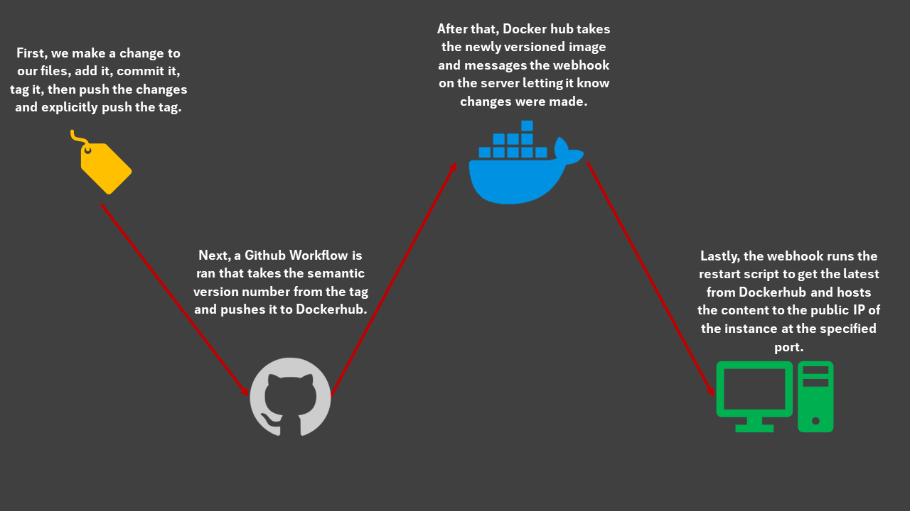

# Part 1

- CD Project Overview
  - For part one of this project I am making a Github workflow that when a tag is pushed to my Github repo, that version tag is then pushed to my dockerhub repo as well. The tags have to use semantic versioning that is gathered using the docker/metadata-action. 

- How to generate a `tag` in `git` / GitHub
  - To make a tag in git you first have to make a change to a file, add it, then commit it. After that you can then run ```git tag -a v0.0.0``` after that you run ```git push origin v0.0.0``` and that pushes the tag to github.

- Behavior of GitHub workflow
  - When a tag is pushed, it uses docker/metadata-action to get the semantic versioning of the tag and splits it into the version number, Major and minor versions, and major version. After that it will log into dockerhub using Github secrets and build and push the changes to the dockerhub repo.ed

- Link to Docker Hub repository (as additional proof)
  - https://hub.docker.com/repository/docker/davidson139/ceg3120project4/tags

# Part 2

- How to install Docker to your instance
  - To install Docker on my instance I followed this link https://docs.docker.com/engine/install/ubuntu/. I had to run a couple of commands to uninstall any conflicting files. Then I ran ```sudo apt-get install docker-ce docker-ce-cli containerd.io docker-buildx-plugin docker-compose-plugin``` to get all the packages I would need. After that I ran hello-world to make sure it was working correctly.
- Container restart script
  - Justification & description of what it does
    - The first two lines of code in the script stop and remove the active container from my current containers list to make way for the latest container that I will pull in the next step. After that I run a docker pull command to get my latest version of my container from dockerhub. The final line of code runs the container. It names it the same name as it was before so the script always works, It detaches it with -d and binds it to port 8080:80 with the -p flag. The --restart always flag ensures that whenever my instance is started this script will get ran.
  - The container restart script is here ```/home/ubuntu/ceg3120s24-ldav99/s24cicd-ldav99/deployment``` and is called "script.sh" 
- Setting up a `webhook` listener on the instance
  - To install the webhook I ran ```sudo apt-get install webhook``` and used systemctl to verify that it was installed and recognized.
- `webhook` task definition file
  - In this file I made a simple webhook that runs my restart script when it is messaged by a service. In my case I set up dockerhub to send the message.
  - I have my file stored at  ```/home/ubuntu/ceg3120s24-ldav99/s24cicd-ldav99/deployment/hooks.json```
- How to start the `webhook`
  - To manually stat the webhook I would have to run ``` sudo /usr/bin/webhook -hooks hooks.json -verbose ``` 
- How to modify/ create a webhook service file such that your webhook listener is listening as soon as the system is booted
  - I made my webhook run automatically by changing the pathing in the service file to point to where my restart script is, while here I also added the  ```-verbose``` flag for my logs.
  - To reload the webhook service after making a change to the service follow it is the following. ```sudo systemctl daemon-reload``` then ```sudo systemctl restart webhook.service```
- How to configure GitHub OR DockerHub to message the listener
  - To make my dockerhub message I went to my dockerhub repo and clicked webhhoks. From there I just named it and added the URL of ```my-instances-public-ip/hooks/hook-name```
- Provide proof that the CI & CD workflow work.
  - Demonstrated in person


# Part 3

