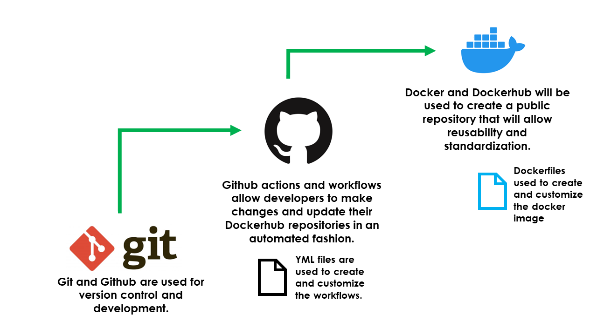

# Part 1

- CI Project Overview
  - So for this project I decided to use nginx again. I had used it for the last project and their image on dockerhub had good documentation. 
- Run Project Locally
  - how to install docker + dependencies (WSL2, for example)
      - To install Docker I followed this article https://docs.docker.com/engine/install/ubuntu/. It had me uninstall any potentially conflicting packages. Then I had to run a couple of commands to setup Dockers apt repository. After that I ran ```sudo apt-get install docker-ce docker-ce-cli containerd.io docker-buildx-plugin docker-compose-plugin``` to get the latest version and all its extras, then ran ```sudo docker run hello-world``` to make sure it worked.
  - how to build an image from the `Dockerfile`
    - I followed nginx's guide for this so I first made my docker file which contained 2 simple lines telling it to grab nginx and copy my index.html file to nginx's html folder. After that I ran ```docker build -t some-content-nginx . ``` to build the image. I then made sure it actually built by running ``` docker image ls```.
  - how to run the container
    - To run the container and expose it to an available port I ran ```docker run --name some-nginx -d -p 8080:80 some-content-nginx``` . Again to check that it worked I ran ``` docker container ls ```
  - how to view the project running in the container (open a browser...go to IP and port...)
    - To see my project running I went to my prowser and typed in localhost/8080 and there was my webpage.

# Part 2
- Process to create public repo in DockerHub
  - To create a public repo in Dockerhub, I started by clicking repositories at the top of the website. From there I clicked the "Create Repository button". I gave it's unique name and added a short description and made sure public was selected then clicked create.
- How to authenticate with DockerHub via CLI using Dockerhub credentials
  - To authenticate I first made a Dockerhub token, I had to go to my dockerhub account and follow the steps to make the token then copy it into a github secret.
  - what credentials would you recommend providing?
    - I would reccomend using a token. Passwords are less secure even if you are using secrets.
- How to push container image to Dockerhub (without GitHub Actions)
  - I tagged the Build and Push in my yml file to be my dockerhub namespace/repoName.
- **Link** to your DockerHub repository
    - https://hub.docker.com/repository/docker/davidson139/ceg3120project4/general
- Configuring GitHub Secrets
  - How to set a secret
    - To set a secret I went into the github repository for this project and went to settings, then secrets and variables. I clicked on repository secrets then filled out my name and put the corresponding information in the secret box. 
  - What secret(s) are set for this project
    - My Dockerhub username and token.
- Behavior of GitHub workflow
  - What does it do and when
    - So whenever you push, the workflow will login and push the changes to the dockerhub repo.
  - What variables in workflow are custom to your project
    - My Dockerhub namespace and repository name. Also my Github secrets.
  - Thing that may need to be changed if someone else is going to use it or you reuse it
    - Yes, they would need to use their own login credentials for dockerhub. 

    I used this link to help me create my workflow: https://docs.github.com/en/actions/publishing-packages/publishing-docker-images

# Part 3
  
